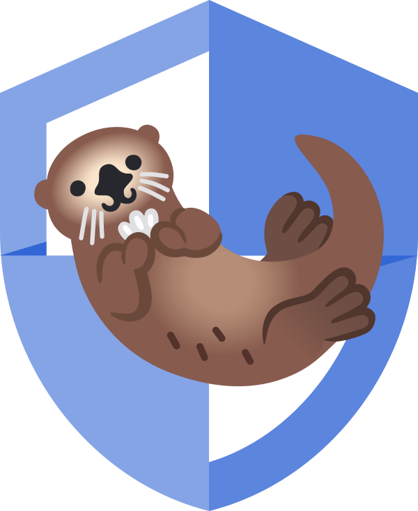

# 🦦 OtterSec

[English README](./README.md)

OtterSec은 에지 컴퓨팅 및 임베디드 하드웨어를 위해 설계된 C++ 기반의 저지연·고보안 비디오 스트리밍 및 텔레메트리 미들웨어입니다. 아웃 오브 밴드(Out-of-band) TLS 키 교환과 UDP 기반의 AES-128-ICM 암호화 SRTP 비디오 스트리밍을 통해 에지 AI 추론 파이프라인과 원격 모니터링 시스템을 안전하게 연결합니다.

---

## 아키텍처 개요

OtterSec은 저대역폭 텔레메트리 모니터링과 고대역폭 비디오 전송을 분리하기 위해 2단계 상태 머신 구조를 사용합니다.

1. **저소음 트립와이어 모드 (TLS/TCP 8080 포트):** 에지 디바이스가 백그라운드 TCP 제어 서버를 실행합니다. 바운딩 박스, 골격 키포인트, 추론 플래그가 포함된 프로토콜 버퍼(`pose_data.proto`) 텔레메트리를 전송합니다. 백엔드 서버는 비상 
    플래그(`fall_detected`)가 
    
    활성화될 때까지 비디오 스트림을 요청하지 않고 대기합니다.
2. **아웃 오브 밴드 TLS 핸드셰이크 (TCP 8443 포트):** 비상 이벤트가 발생하면 OtterSec은 8443 포트에 OpenSSL TLS 서버를 오픈합니다. 백엔드 클라이언트가 TLS로 접속하면 `RAND_bytes()`를 통해 30바이트의 암호학적으로 안전한 의사 난수 키(16바이트 AES Master Key + 14바이트 Master Salt)를 생성하여 TLS 터널로 전송합니다.
3. **암호화된 SRTP 스트리밍 (UDP 5004 포트):** 키 전송 직후 TLS 소켓이 닫힙니다. OtterSec은 하드웨어 가속 GStreamer 파이프라인(`appsrc ! videoconvert ! x264enc ! srtpenc ! udpsink`)을 활성화하여 SRTP(`aes-128-icm`)로 암호화된 H.264 비디오를 전송합니다. 비디오 패킷은 `baseline` 프로필, B-프레임 비활성화(`bframes=0`)로 설정되며 고정 SSRC (`ssrc=112233`)로 태깅됩니다.
4. **비상 비콘 및 원격 재가동 (Re-Arming):** 비상 상황 시 OtterSec은 주기적인 비콘 텔레메트리를 전송하여 늦게 접속하거나 재시작된 백엔드가 즉시 알림을 수신할 수 있도록 합니다. 작업자는 TLS를 통해 `OTTER_RESOLVE_CMD` 명령을 전송하여 비디오 파이프라인을 종료하고 RAM에서 키를 소거한 후 트립와이어를 재가동할 수 있습니다.

---

## 주요 기능

- **제로 트러스트 키 분배:** 정적 암호화 키를 디스크에 저장하거나 바이너리에 하드코딩하지 않습니다. 모든 키는 이벤트 발생 시 OpenSSL PRNG를 통해 동적으로 생성됩니다.
- **메모리 소거 (Memory Scrubbing):** 세션 종료 시 C++ 내부 암호화 버퍼는 `OPENSSL_cleanse()`를 호출하여 RAM에 남아있는 키 재료를 완전히 삭제합니다.
- **하드웨어 최적화 비디오 파이프라인:** GStreamer `appsrc`와 네이티브하게 통합되며, 웹 호환성을 위해 초저지연 H.264 인코딩 옵션(`key-int-max=30`, `bframes=0`, `profile=baseline`, `mtu=1400`, `bitrate=2048`)으로 설정됩니다.
- **안정적인 전송:** 무선 네트워크 환경에서 패킷 순서 역전 및 클록 동기화 이탈을 방지하기 위해 `rtpjitterbuffer` 및 명시적 `SSRC` 바인딩을 적용했습니다.
- **다중 언어 확장성:** 순수 C-API 경계(`extern "C"`), `pybind11` 기반 Python 바인딩 및 Node.js 연동을 지원합니다.

---

## 디렉토리 구조

```text
ottersec/
├── CMakeLists.txt
├── include/
│   └── ottersec/
│       ├── api.h
│       └── types.h
├── proto/
│   └── pose_data.proto
└── src/
    ├── api.cpp
    ├── bindings/
    │   └── python/
    │       ├── CMakeLists.txt
    │       └── pybind_module.cpp
    ├── core/
    │   ├── control_server.cpp
    │   ├── control_server.hpp
    │   ├── handshake_server.cpp
    │   ├── handshake_server.hpp
    │   ├── security_context.cpp
    │   ├── security_context.hpp
    │   ├── session_manager.cpp
    │   └── session_manager.hpp
    └── pipeline/
        ├── gstreamer_pipeline.cpp
        └── gstreamer_pipeline.hpp

```

---

## 환경 설정 및 설치

### 1. 에지 디바이스 설정 (C++ / Linux / Fedora / Raspberry Pi OS)

#### 시스템 의존성 설치

컴파일러 툴체인, OpenSSL, GStreamer 개발 라이브러리 및 Protobuf 컴파일러를 설치합니다.

**Fedora / RHEL:**

```bash
sudo dnf groupinstall -y "Development Tools" "C Development Tools and Libraries"
sudo dnf install -y cmake openssl-devel \
    gstreamer1-devel gstreamer1-plugins-base-devel gstreamer1-plugins-bad-free-devel \
    protobuf-compiler protobuf-devel pybind11-devel

```

**Debian / Ubuntu / Raspberry Pi OS:**

```bash
sudo apt-get update
sudo apt-get install -y build-essential cmake libssl-dev \
    libgstreamer1.0-dev libgstreamer-plugins-base1.0-dev libgstreamer-plugins-bad1.0-dev \
    protobuf-compiler libprotobuf-dev pybind11-dev

```

#### 개발용 TLS 증명서 생성

아웃 오브 밴드 TLS 협상을 위한 자체 서명 개발용 증명서를 생성합니다.

```bash
mkdir -p certs
openssl req -x509 -newkey rsa:4096 \
  -keyout certs/server.key \
  -out certs/server.crt \
  -days 365 -nodes \
  -subj "/CN=127.0.0.1"

```

#### `libottersec` 빌드 및 설치

```bash
# 리포지토리 클론 및 이동
git clone https://github.com/Sudeep-Sharma0-0/ottersec.git
cd ottersec

# C++ 공유 라이브러리 및 Python 확장 빌드
mkdir build && cd build
cmake .. -DCMAKE_BUILD_TYPE=Release
make -j$(nproc)

# 시스템 전역 설치
sudo make install
sudo ldconfig

```

#### Example Code Structure
```cpp
#include <ottersec/api.h>
#include <iostream>

int main() {
    // 1. Configure and Initialize OtterSec
    OtterHandshakeConfig config = {8443, 5000, "certs/server.crt", "certs/server.key"};
    ottersec_init(&config);
    ottersec_start_control_server(8080); // Start Silent Tripwire

    std::cout << "[Edge] System Armed. Monitoring...\n";

    while (true) {
        // 2. Push raw frames to the GStreamer pipeline buffer
        OtterFrameBuffer fb = {640, 640, my_rgb_frame_ptr, 0};
        ottersec_push_frame(&fb);

        // 3. Trigger Emergency Secure Stream on Detection
        if (check_if_fall_detected()) {
            std::cout << "[Edge] Fall Detected! Initiating Secure Video Stream...\n";
            OtterFallEvent evt = {1, 0.95f}; // confidence = 0.95
            ottersec_notify_fall(&evt); 
        }

        // 4. Remote Re-arm via Dashboard
        if (ottersec_check_remote_resolve()) {
            std::cout << "[Edge] Incident Resolved remotely. Re-arming...\n";
            ottersec_terminate();
            ottersec_init(&config);
            ottersec_start_control_server(8080);
        }
    }
    return 0;
}
```

---

### 2. Python 백엔드 설정

Python 백엔드는 TCP 8080에 접속하여 Protobuf 텔레메트리를 파싱하고, 낙상 감지 시 TCP 8443 포트에서 TLS 핸드셰이크를 수행하여 SRTP 키를 수신한 후 GStreamer를 통해 복호화된 비디오를 재생합니다.

#### Python 의존성 설치 및 Protobuf 스텁 생성

```bash
python3 -m venv venv
source venv/bin/activate

# 필수 패키지 설치
pip install protobuf

# Python용 Protocol Buffer 컴파일
protoc -I=proto --python_out=. proto/pose_data.proto

```

#### Example Python Backend Code
```python
import socket
import ssl
import subprocess

EDGE_IP = '192.168.1.111'

# 1. Connect to Silent Tripwire
print("[Backend] Connecting to Tripwire...")
sock = socket.socket(socket.AF_INET, socket.SOCK_STREAM)
sock.connect((EDGE_IP, 8080))

# Wait for telemetry packet indicating a fall
data = sock.recv(1024) 
print("[Backend] 🚨 ALERT RECEIVED! Fetching keys...")
sock.close()

# 2. Connect via TLS to fetch AES Key
context = ssl.create_default_context()
context.check_hostname = False
context.verify_mode = ssl.CERT_NONE

with socket.create_connection((EDGE_IP, 8443)) as raw_sock:
    with context.wrap_socket(raw_sock, server_hostname=EDGE_IP) as secure_sock:
        crypto_bytes = secure_sock.recv(30)
        hex_key = crypto_bytes.hex()
        print(f"[Backend] 🔐 Key Received: {hex_key}")

# 3. Launch GStreamer to decrypt video
srtp_caps = f"application/x-srtp,payload=(int)96,ssrc=(uint)112233,srtp-cipher=(string)aes-128-icm,srtp-auth=(string)hmac-sha1-80,srtcp-cipher=(string)aes-128-icm,srtcp-auth=(string)hmac-sha1-80,srtp-key=(buffer){hex_key}"

subprocess.run([
    "gst-launch-1.0", "udpsrc", "port=5004",
    "!", srtp_caps, "!", "srtpdec",
    "!", "rtph264depay", "!", "h264parse", "!", "avdec_h264", "!", "autovideosink"
])
```

#### Python 백엔드 실행

```bash
python3 backend.py

```

---

### 3. Node.js 백엔드 및 대시보드 설정

Node.js 백엔드는 TLS 핸드셰이크, Protobuf 텔레메트리 디코딩, GStreamer 기반의 헤드리스 SRTP 비디오 복호화 및 HTML5 대시보드(`JMuxer`)로의 실시간 WebSocket 브로드캐스팅을 처리합니다.

#### Node.js 의존성 설치

```bash
# Node 프로젝트 초기화 및 의존성 설치
npm install express ws protobufjs

```

#### 디렉토리 구성

프로젝트 루트에 컴파일된 `pose_data.proto` 파일과 HTML5 프론트엔드가 포함되어 있어야 합니다.

```text
project-root/
├── server.js
├── pose_data.proto
└── public/
    └── index.html

```

##### server.js
```js
const net = require('net');
const tls = require('tls');
const { spawn } = require('child_process');

const EDGE_IP = '192.168.1.111';

// 1. Connect to Silent Tripwire
const client = new net.Socket();
client.connect(8080, EDGE_IP, () => {
    console.log('[Backend] Connected to Tripwire. Waiting for events...');
});

client.on('data', (data) => {
    // (In production, decode Protobuf here)
    console.log('[Backend] 🚨 ALERT RECEIVED! Fetching secure video keys...');
    client.destroy();
    
    // 2. Connect via TLS to fetch AES SRTP Key
    const secureSocket = tls.connect({ host: EDGE_IP, port: 8443, rejectUnauthorized: false }, () => {
        console.log('[Backend] TLS Secured.');
    });

    secureSocket.on('data', (cryptoBytes) => {
        const hexKey = cryptoBytes.toString('hex');
        console.log(`[Backend] 🔐 Key Received: ${hexKey}`);
        secureSocket.end();
        
        // 3. Launch GStreamer to Decrypt UDP 5004 Video Stream
        const srtpCaps = `application/x-srtp,payload=(int)96,ssrc=(uint)112233,srtp-cipher=(string)aes-128-icm,srtp-auth=(string)hmac-sha1-80,srtcp-cipher=(string)aes-128-icm,srtcp-auth=(string)hmac-sha1-80,srtp-key=(buffer)${hexKey}`;
        
        spawn('gst-launch-1.0', [
            'udpsrc', 'port=5004', 
            '!', srtpCaps, 
            '!', 'srtpdec', 
            '!', 'rtph264depay', '!', 'h264parse', '!', 'avdec_h264', '!', 'autovideosink'
        ], { stdio: 'inherit' });
    });
});
```

#### Node.js 서버 실행

```bash
node server.js

```

웹 브라우저를 열고 `http://localhost:3000`으로 접속합니다.

---

## C-API 레퍼런스

모든 C-API 함수는 `#include <ottersec/api.h>`를 통해 노출되며 `extern "C"` 블록 내에 정의되어 있습니다.

| 함수명 | 반환 타입 | 설명 |
| --- | --- | --- |
| `ottersec_init(const OtterHandshakeConfig *config)` | `int` | 세션 상태 머신을 초기화하고 TLS 인증서를 로드합니다. 성공 시 `0` 반환. |
| `ottersec_start_control_server(int port)` | `int` | 영구 TCP 트립와이어 서버를 시작합니다 (기본 포트 `8080`). 성공 시 `0` 반환. |
| `ottersec_send_telemetry(const OtterInferenceResult *result)` | `int` | 텔레메트리를 Protobuf로 직렬화하여 길이 접두사(Length-prefixed) 형태로 TCP 전송합니다. |
| `ottersec_notify_fall(const OtterFallEvent *event)` | `int` | 상태를 `IDLE`에서 `HANDSHAKING`으로 전환하고 8443 포트에 TLS 서버를 구동합니다. |
| `ottersec_push_frame(const OtterFrameBuffer *frame)` | `int` | 원시 RGB 프레임을 `appsrc`에 주입합니다. `STREAMING` 상태에서만 동작합니다. |
| `ottersec_check_remote_resolve()` | `int` | `OTTER_RESOLVE_CMD` 수신 여부를 원자적으로(Thread-safe) 확인하고 플래그를 리셋합니다. |
| `ottersec_stop_control_server()` | `void` | TCP 트립와이어 서버를 독립적으로 정지합니다. |
| `ottersec_terminate()` | `void` | 파이프라인을 정지하고 `OPENSSL_cleanse()`로 키 메모리를 소거한 후 세션을 `IDLE`로 리셋합니다. |

---

## 트러블슈팅

### 포트 점유 / TIME_WAIT

프로세스가 비정상 종료된 경우 OS 커널이 `8080` 또는 `8443` 포트를 `TIME_WAIT` 상태로 유지할 수 있습니다. 수동으로 해제합니다:

```bash
sudo fuser -k 8080/tcp
sudo fuser -k 8443/tcp

```

### 비디오 번짐 및 녹색 프레임 현상

녹색 번짐 아티팩트는 제로 카피 버퍼 전달 시 발생하는 메모리 경합 조건(Memory Race Condition)으로 인해 발생합니다. `push_frame()` 호출 시 `gst_buffer_new_allocate()`를 사용하여 격리된 `GstBuffer` 메모리를 할당하고 프레임을 복사한 후 GStreamer에 전달해야 합니다.

